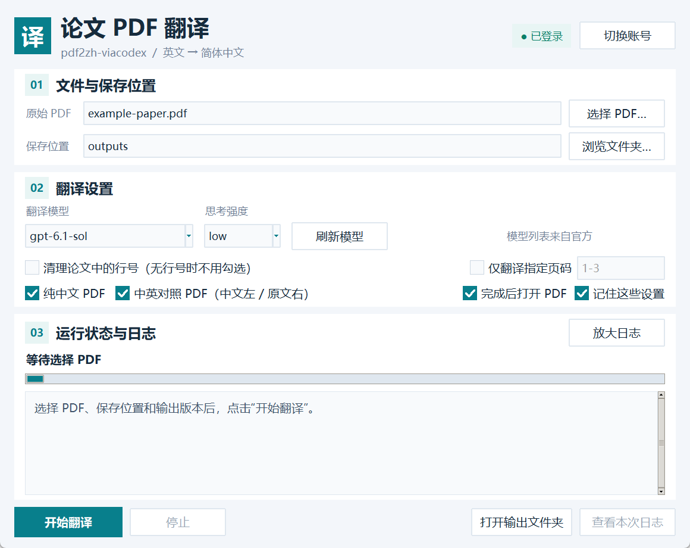

# pdf2zh-viacodex

用 **pdf2zh-next 解析和排版 PDF**，用 **官方 Codex CLI + ChatGPT 登录翻译论文**。

这是面向 Windows 10/11 的独立开源桌面工具。每位使用者在自己的电脑上登录自己的 ChatGPT 账号，通过账号可用的 Codex 模型翻译英文论文，无需配置 API Key。实际可用模型和额度由 OpenAI 与账号套餐决定；不是无限免费翻译，也不提供额度共享。



截图仅展示界面，实际模型和思考强度以账号返回的官方列表为准。

## 功能

- 英文论文 → 简体中文，沿用 pdf2zh-next / BabelDOC 的公式、图形和版面处理。
- 生成纯中文 PDF、中英对照 PDF，或同时生成两份。对照版中文在左、原文在右；两种输出只翻译一次。
- 指定原文页码，例如 `1-3`、`1,3,5-7`；对照页按原文顺序配对。
- 可选清理连续边栏行号，仅处理副本；对照版右侧保留原文。
- 图形界面选择模型和思考强度，候选项来自官方 `model/list`，不是固定名单。
- 批量翻译，每批最多 12 段，最多 4 批并行；缓存按模型与强度隔离。
- “停止”完成后按钮变为“继续”，保留同配置译文缓存；日志可滚动和放大。
- 每次创建独立输出任务目录，保留进度、调用用量及完成校验记录。

## 运行要求

- Windows 10/11，Python **3.11 或 3.12**，包含 Tcl/Tk（推荐 Python 官网完整安装器）。
- 联网环境，可访问 PyPI、PDF 版面模型/字体下载站点及 OpenAI。
- 账号具有 Codex 使用权限；在本工具中通过官方 ChatGPT 登录。
- 已安装官方 Codex CLI / Codex 桌面应用，或者安装 Node.js LTS，让安装脚本安装官方 `@openai/codex`。

代码包含其他平台的部分兼容处理，但本版本的安装入口和 GUI 验证针对 Windows；不将 macOS/Linux 标为已验证支持。

## 快速开始

1. 下载或克隆源码，解压到自己可写的目录，路径可以包含空格或中文。请勿将项目放进只读的论文资料目录。
2. 双击 **`安装依赖.cmd`**（英文入口 `setup.cmd`）。第一次下载依赖和版面模型可能需要较长时间。
3. 双击 **`登录ChatGPT.cmd`**（`login.cmd`），在官方浏览器登录页面完成登录。账号只保存在本机的 `.runtime/codex-home`。
4. 双击 **`翻译PDF.cmd`**（`start.cmd`），选择英文 PDF、保存位置、页码、行号清理及输出类型。
5. 等官方模型目录加载完成后，选择模型和思考强度，点击“开始翻译”。

界面的“登录 ChatGPT”按钮直接运行 `登录ChatGPT.cmd`，与双击脚本使用同一入口，脚本输出直接显示在界面日志中，不弹出短暂的命令窗口。每次点击都会打开新的浏览器授权，即使当前已经登录。原账号保留到新授权成功；成功后切换为本次授权的账号并刷新模型，取消或失败时原账号不变。等待授权时按钮变为“取消登录”，5 分钟未完成则自动超时；等待期间刷新模型、开始或继续翻译保持禁用，登录结束后恢复。成功切换前会在 `.runtime/codex-home/account-history/` 中保留旧登录的本地备份，该目录不会进入 Git 或源码包。

在 PowerShell 中安装也可运行：

```powershell
powershell -NoProfile -ExecutionPolicy Bypass -File .\scripts\setup.ps1
# 明确选择已安装的 Python：
powershell -NoProfile -ExecutionPolicy Bypass -File .\scripts\setup.ps1 -PythonExe "C:\Python312\python.exe"
```

安装默认使用官方 PyPI；可用 `-IndexUrl` 指定自己信任的镜像。运行 `检查环境.cmd` 可检查依赖、缓存隔离、Codex CLI 与 ChatGPT 登录。

## 使用与结果

默认结果在项目 `outputs/`；也可在界面选择其他文件夹。结果文件名包含本次模型名称，例如 `论文名_中文_gpt-6.1-sol.pdf`、`论文名_中英对照_gpt-6.1-sol.pdf`。原始 PDF 不会覆盖。只选“中英对照”时，最终目录只交付对照 PDF，中文排版中间文件留在 `.runtime/tmp`。

运行中模型和强度控件被禁用。停止完成后可重新选择，再点击“继续”：文件、页码和输出选项沿用暂停前设置，模型与强度使用当前选择。**换模型或强度不会自动复用旧配置的缓存**，可能重新翻译已处理段落。继续同配置任务会重新解析和排版，仅对缓存缺失段落调用 Codex。

本版本的“继续”状态在当前窗口内保存；关闭后重新打开不会自动开始任务。重新选择同一文件与设置并开始，仍可复用已完成缓存。正在执行且还未返回的批次在停止时无法保存。

```powershell
.\.venv\Scripts\python.exe -B project.py translate "C:\papers\paper.pdf" --pages 1-3 --remove-line-numbers --output-mode both
.\.venv\Scripts\python.exe -B project.py models
.\.venv\Scripts\python.exe -B project.py doctor
.\.venv\Scripts\python.exe -B project.py test
```

详细说明见 [使用说明](docs/usage.md)、[实现与开发](docs/development.md) 和 [发布到 GitHub](docs/publishing.md)。

## 账号与数据

- 每位使用者登录自己的账号；仓库、源码包和测试不包含开发者账号凭据。
- 不从 Codex 全局登录目录自动复制账号；不改动全局模型配置。
- 子进程清除常见 API Key / 自定义 API 地址环境变量，并固定官方 provider + ChatGPT 登录；失败时停止，不切换付费 API。
- 论文段落会发送给 OpenAI 的 Codex 服务，版面解析在本机运行。请使用自己有权处理的文档。
- `.runtime/` 中的账号、论文副本、缓存和日志是本地数据。它与 `.venv/`、`outputs/` 均在 `.gitignore` 中。
- 发布源码请使用项目提供的打包脚本；不要直接压缩已使用过的整个文件夹。

## 限制

复杂表格、双栏、图内文字和扫描 PDF 的效果取决于 pdf2zh-next / BabelDOC 与 OCR。行号清理是保守规则，不保证匹配所有版式。翻译时间受论文篇幅、缓存、网络、额度与模型影响，没有任意论文 20 分钟完成的保证。完成后仍应抽查公式、数值、引用和代表页。

## 开源与致谢

项目采用 **AGPL-3.0-or-later**。pdf2zh-next / BabelDOC / PyMuPDF 的许可说明见 [THIRD_PARTY_NOTICES.md](THIRD_PARTY_NOTICES.md)。它不是 OpenAI 官方产品，与 OpenAI 无隶属关系。

官方参考：[Codex 登录](https://developers.openai.com/codex/auth/)、[model/list](https://developers.openai.com/codex/app-server/#list-models-modellist)、[官方 CLI](https://github.com/openai/codex)。
